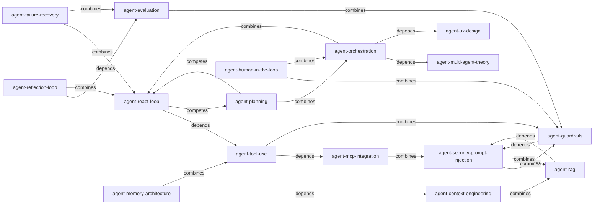

# KNOWLEDGE_GRAPH — Skill 引用关系图

> 关系: depends(依赖)/ competes(对比)/ combines(组合)
> Mermaid 图 + 关系表

## 关系图

## 关系明细

### depends(依赖)
| skill | 依赖 | 说明 |
|---|---|---|
| agent-react-loop | agent-tool-use | Action 步骤调用工具 |
| agent-reflection-loop | agent-evaluation | 评估标准设计 |
| agent-orchestration | agent-multi-agent-theory | 理论指导编排 |
| agent-orchestration | agent-ux-design | 多 agent 需 UX |
| agent-tool-use | agent-mcp-integration | MCP 标准化接入 |
| agent-memory-architecture | agent-context-engineering | 上下文管理含记忆层 |
| agent-rag | agent-security-prompt-injection | 检索内容防注入 |
| agent-guardrails | agent-security-prompt-injection | 输入净化是输入闸 |
| agent-failure-recovery | agent-evaluation | 失败模式监控 |

### competes(对比)
| skill A | skill B | 对比点 |
|---|---|---|
| agent-react-loop | agent-planning | 边想边做 vs 先规划后做 |
| agent-planning | agent-react-loop | 同上 |

### combines(组合)
| 组合 | 场景 |
|---|---|
| react + reflect | ReAct 循环后嵌入反思 |
| orch + react | 多 agent 内每个用 ReAct |
| tool + guard | 工具权限控制 |
| mcp + sec | MCP 工具输入净化 |
| ctx + rag | 检索注入上下文 |
| eval + guard | 安全评估维度 |
| hitl + guard | 规则闸+人工闸 |
| fail + react | 循环终止条件 |
| sec + rag | 检索可信度 |

## 主题簇

1. **核心循环簇**: react, reflect, plan, fail → agent 单体内循环
2. **能力簇**: tool, mcp, memory, rag → agent 外部能力
3. **协作簇**: orch, theory, ux → 多 agent 协作
4. **治理簇**: guard, sec, hitl, eval → 安全与质量
5. **上下文簇**: ctx, memory, rag → 信息管理
